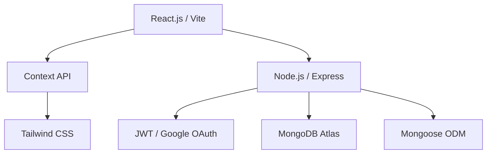

# 🏨 ApnaStays — Premium Hotel Booking Ecosystem

ApnaStays is a high-performance, full-stack MERN application engineered for the modern travel industry. It delivers a seamless, high-end experience for both travelers looking for their next stay and property owners managing diverse portfolios.

---

## 💎 Experience the Future of Hospitality

| View | Purpose | Link |
| :--- | :--- | :--- |
| **User Portal** | Browse, Filter, and Book | [Live Frontend](https://hotel-booking-system-tawny.vercel.app/) |
| **API Backbone** | Scalable Node/Express Backend | [Live Backend](https://hotel-booking-system-rv34.onrender.com) |
| **System Status** | Health Monitoring | [Check Status](https://hotel-booking-system-rv34.onrender.com/api/health) |

---

## 🔥 Key Highlights

### **For Travelers**
- ⚡ **Lightning Fast Search**: Advanced filtering by city, price range, and amenities.
- 🛡️ **Google OAuth 2.0 Integration**: Secure, one-tap login experience alongside traditional JWT.
- 📱 **Mobile-First Design**: Optimized for any screen size with a premium aesthetic.
- 📅 **Smart Booking**: Intuitive checkout flow with real-time status tracking.

### **For Property Owners**
- 📊 **Intelligent Dashboard**: Minimalist, data-driven interface for managing hotels and rooms.
- 📈 **Revenue Analytics**: Track performance and bookings at a glance.
- 🛠️ **Full Resource Control**: Effortless CRUD operations for properties and inventories.

---

## 🛠️ Technology Architecture



### **Core Stack**
- **Frontend**: React 18, Vite, Tailwind CSS, React Router 6.
- **Backend**: Node.js, Express.js, JWT, Google OAuth 2.0.
- **Database**: MongoDB Atlas with Mongoose logic layer.

---

## 🚀 Getting Started

### **1. Clone & Install**
```bash
git clone https://github.com/MaverickP24/Hotel-Booking-System.git
cd Hotel-Booking-System
```

### **2. Backend Configuration**
```bash
cd backend
npm install
cp .env.example .env
```
> [!IMPORTANT]
> Update your `.env` with your MongoDB URI, JWT Secret, and Google Cloud Console credentials.

### **3. Frontend Configuration**
```bash
cd ../frontend
npm install
```
Ensure your `frontend/.env` points to the backend:
```env
VITE_API_URL=http://localhost:5001/api
```

### **4. Start Development**
Using two terminal windows:
```bash
# Terminal 1: Backend
cd backend && npm run dev

# Terminal 2: Frontend
cd frontend && npm run dev
```

---

## 📂 Architecture Overview

- **Backend**: MVC-inspired structure with strictly defined routes and middleware for security and validation.
- **Frontend**: Component-based architecture with centralized state management through the Context API.

---

## 📜 Development Standards

This project maintains:
- ✅ Strictly typed API responses.
- ✅ Clean, semantic HTML.
- ✅ Modularized CSS utilities via Tailwind.
- ✅ Secure password hashing utilizing `bcryptjs`.

---

Developed with ❤️ by Pratyush Parida
